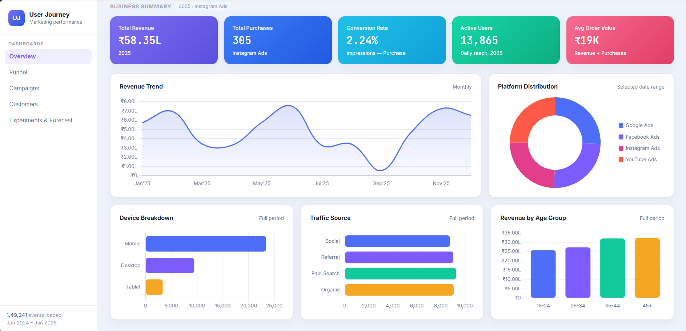

# User Journey Funnel Analysis & Marketing Analytics Platform

**🔗 Live Demo: [user-funnel-analysis.onrender.com](https://user-funnel-analysis.onrender.com)**

This platform gives you the full picture of a customer's journey — from their first ad impression all the way to purchase — no matter which digital channel they came through. Everything lands in a clean, interactive dashboard with straight-to-the-point, AI-powered insights.

**The real issue:** companies pour money into ads on Google, Meta, LinkedIn, YouTube, email — you name it — but ask basic questions like *"Where do most people drop off?"*, *"Which campaigns are actually bringing in money?"*, or *"How should we split next month's budget?"* and the answers usually aren't clear. This platform changes that, with numbers you can actually trust.



## What you get

- **Synthetic data engine** — generates thousands of realistic user journeys (ad view → purchase) across 8 different industries. Real marketing data isn't public, so this fills the gap with lifelike patterns instead of random numbers.
- **Campaign & funnel analysis** — click-through rates, conversion rates, where customers bail out, cart abandonment — all broken down by stage.
- **Segmentation & cohort analysis** — how different customer types behave, and how retention looks by acquisition month.
- **A/B testing** — Z-test based stats to compare ad variants, so you know what's actually working.
- **Forecasting** — future revenue, purchases, and conversion rates, modeled with ARIMA and properly validated.
- **Markov attribution** — see what happens if you remove a channel entirely, a much deeper answer than "last-click wins."
- **AI insights** — natural language summaries powered by Gemini, plus a chatbot for business questions right on top of the numbers.
- **Interactive dashboard** — a standalone HTML/CSS/JS dashboard (styled like Power BI) that just reads pre-summarized numbers — no slow recalculation in the browser.

## Tech Stack

`Python` · `Pandas` / `NumPy` · `MySQL + SQLAlchemy` · `SciPy` · `Statsmodels (ARIMA)` · `Google Gemini API` · `HTML/CSS/JS` · `Chart.js` · `ECharts`

## Architecture

```
Synthetic Data Generator → MySQL → Analytics Modules → Dashboard Generator → HTML Dashboard
```

Each analytics module saves its own summary table. The dashboard just reads and visualizes — it doesn't crunch any numbers on the fly. Data generation, analytics, and presentation are kept completely separate.

## Folder Structure

```
user-funnel-analysis/
├── database/          # data pipeline: connection, load, plus 8 analytics modules
├── datasets/          # generated CSV summary tables
├── synthetic_data/    # user journey generator and raw event data
└── dashboard/         # standalone HTML dashboard
```

## How to Run

```bash
pip install -r requirements.txt
cp .env.example .env    # add your MySQL and Gemini credentials
```

Then: generate the synthetic data → load it into MySQL → run the analytics modules in `database/` → open `dashboard/complete_user_funnel_dashboard.html`.

## Key Features

- Simulates thousands of user journeys with conversion behavior that matches each industry — not flat randomness.
- 8 separate analytics modules (campaigns, funnel, cohorts, segmentation, A/B tests, forecasting, attribution, AI) instead of one tangled report — each writes its own summary table.
- Attribution actually moves beyond last-click using a Markov removal-effect model.
- Forecasts are checked with MAE, RMSE, AIC, and BIC — not just fancy lines on a chart.
- The AI layer translates raw KPIs into real business recommendations, with a built-in Q&A chatbot.
- The dashboard is pure display — every metric is pre-calculated, so you get speed and accuracy from the first load.